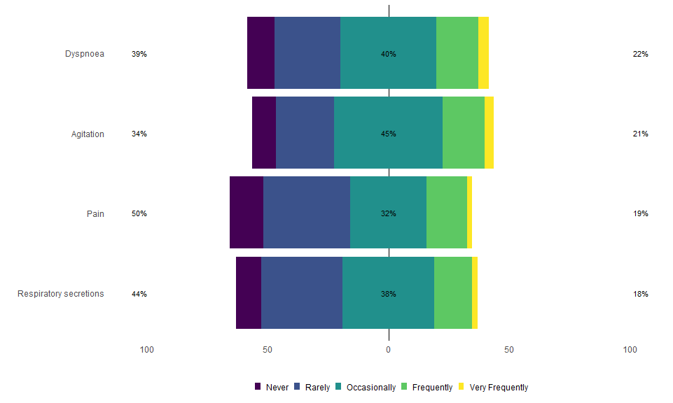
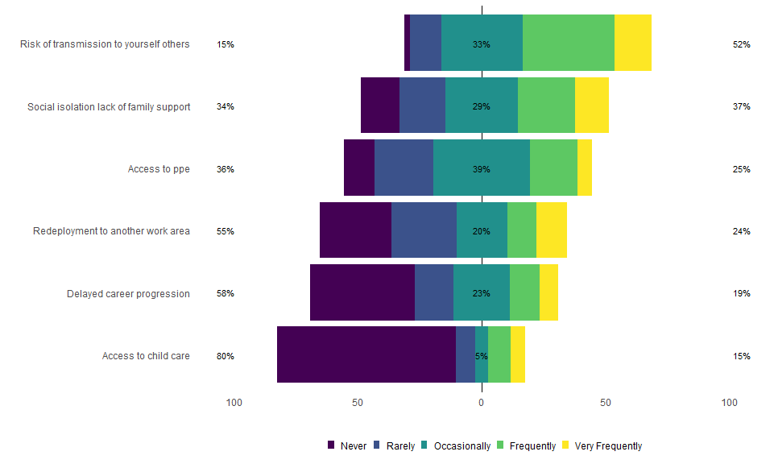

## With regard to symptom control of the dying patient, how often do you get anxious managing the below?

<!-- -->

### By role

<!-- -->

## During the pandemic how often do the below cause anxiety?

<!-- -->

### By role

<!-- -->

## With regard to family interactions during this pandemic, how often do you feel the situations below cause you anxiety?

<!-- -->

### By role

<!-- -->

## Binary reponses


<!-- -->

### By role


<!-- -->

## Simple tests do differences by role


|var                                     |       p|  m|  i|    q|      fdrp|bh_sig1 |bon_sig |
|:---------------------------------------|-------:|--:|--:|----:|---------:|:-------|:-------|
|response_24                             | 2.7e-02| 18|  1| 0.05| 0.0027778|TRUE    |TRUE    |
|response_14                             | 8.4e-02| 18|  2| 0.05| 0.0055556|TRUE    |TRUE    |
|breaking_bad_news                       | 1.5e-02| 18|  3| 0.05| 0.0083333|TRUE    |TRUE    |
|respiratory_secretions                  | 3.2e-02| 18|  4| 0.05| 0.0111111|TRUE    |FALSE   |
|bereavement_support                     | 1.2e-02| 18|  5| 0.05| 0.0138889|TRUE    |FALSE   |
|redeployment_to_another_work_area       | 1.4e-01| 18|  6| 0.05| 0.0166667|TRUE    |FALSE   |
|social_isolation_lack_of_family_support | 8.6e-01| 18|  7| 0.05| 0.0194444|TRUE    |FALSE   |
|access_to_ppe                           | 1.4e-01| 18|  8| 0.05| 0.0222222|FALSE   |FALSE   |
|access_to_child_care                    | 7.8e-01| 18|  9| 0.05| 0.0250000|FALSE   |FALSE   |
|enforced_visiting_restrictions          | 1.1e-01| 18| 10| 0.05| 0.0277778|FALSE   |FALSE   |
|risk_of_transmission_to_yourself_others | 1.1e-02| 18| 11| 0.05| 0.0305556|FALSE   |FALSE   |
|agitation                               | 3.6e-02| 18| 12| 0.05| 0.0333333|FALSE   |FALSE   |
|response_26                             | 2.4e-03| 18| 13| 0.05| 0.0361111|FALSE   |FALSE   |
|pain                                    | 1.2e-02| 18| 14| 0.05| 0.0388889|FALSE   |FALSE   |
|delayed_career_progression              | 6.5e-06| 18| 15| 0.05| 0.0416667|FALSE   |FALSE   |
|response_25                             | 2.5e-01| 18| 16| 0.05| 0.0444444|FALSE   |FALSE   |
|dyspnoea                                | 1.4e-01| 18| 17| 0.05| 0.0472222|FALSE   |FALSE   |
|response_13                             | 7.0e-04| 18| 18| 0.05| 0.0500000|FALSE   |FALSE   |


<!--html_preserve--><div class="container st-container">
<h3>Data Frame Summary</h3>
<h4>data</h4>
<strong>Dimensions</strong>: 161 x 25
  <br/><strong>Duplicates</strong>: 0
<br/>
<table class="table table-striped table-bordered st-table st-table-striped st-table-bordered st-multiline ">
  <thead>
    <tr>
      <th align="center" class="st-protect-top-border"><strong>No</strong></th>
      <th align="center" class="st-protect-top-border"><strong>Variable</strong></th>
      <th align="center" class="st-protect-top-border"><strong>Stats / Values</strong></th>
      <th align="center" class="st-protect-top-border"><strong>Freqs (% of Valid)</strong></th>
      <th align="center" class="st-protect-top-border"><strong>Graph</strong></th>
      <th align="center" class="st-protect-top-border"><strong>Valid</strong></th>
      <th align="center" class="st-protect-top-border"><strong>Missing</strong></th>
    </tr>
  </thead>
  <tbody>
    <tr>
      <td align="center">1</td>
      <td align="left">age
[character]</td>
      <td align="left">1. 24
2. 27
3. 28
4. 30
5. 25
6. 29
7. 45
8. 31
9. 37
10. 40
[ 32 others ]</td>
      <td align="left" style="padding:0;vertical-align:middle"><table style="border-collapse:collapse;border:none;margin:0"><tr style="background-color:transparent"><td style="padding:0 5px 0 7px;margin:0;border:0" align="right">11</td><td style="padding:0 2px 0 0;border:0;" align="left">(</td><td style="padding:0;border:0" align="right">6.9%</td><td style="padding:0 4px 0 2px;border:0" align="left">)</td></tr><tr style="background-color:transparent"><td style="padding:0 5px 0 7px;margin:0;border:0" align="right">11</td><td style="padding:0 2px 0 0;border:0;" align="left">(</td><td style="padding:0;border:0" align="right">6.9%</td><td style="padding:0 4px 0 2px;border:0" align="left">)</td></tr><tr style="background-color:transparent"><td style="padding:0 5px 0 7px;margin:0;border:0" align="right">9</td><td style="padding:0 2px 0 0;border:0;" align="left">(</td><td style="padding:0;border:0" align="right">5.7%</td><td style="padding:0 4px 0 2px;border:0" align="left">)</td></tr><tr style="background-color:transparent"><td style="padding:0 5px 0 7px;margin:0;border:0" align="right">9</td><td style="padding:0 2px 0 0;border:0;" align="left">(</td><td style="padding:0;border:0" align="right">5.7%</td><td style="padding:0 4px 0 2px;border:0" align="left">)</td></tr><tr style="background-color:transparent"><td style="padding:0 5px 0 7px;margin:0;border:0" align="right">8</td><td style="padding:0 2px 0 0;border:0;" align="left">(</td><td style="padding:0;border:0" align="right">5.0%</td><td style="padding:0 4px 0 2px;border:0" align="left">)</td></tr><tr style="background-color:transparent"><td style="padding:0 5px 0 7px;margin:0;border:0" align="right">8</td><td style="padding:0 2px 0 0;border:0;" align="left">(</td><td style="padding:0;border:0" align="right">5.0%</td><td style="padding:0 4px 0 2px;border:0" align="left">)</td></tr><tr style="background-color:transparent"><td style="padding:0 5px 0 7px;margin:0;border:0" align="right">6</td><td style="padding:0 2px 0 0;border:0;" align="left">(</td><td style="padding:0;border:0" align="right">3.8%</td><td style="padding:0 4px 0 2px;border:0" align="left">)</td></tr><tr style="background-color:transparent"><td style="padding:0 5px 0 7px;margin:0;border:0" align="right">5</td><td style="padding:0 2px 0 0;border:0;" align="left">(</td><td style="padding:0;border:0" align="right">3.1%</td><td style="padding:0 4px 0 2px;border:0" align="left">)</td></tr><tr style="background-color:transparent"><td style="padding:0 5px 0 7px;margin:0;border:0" align="right">5</td><td style="padding:0 2px 0 0;border:0;" align="left">(</td><td style="padding:0;border:0" align="right">3.1%</td><td style="padding:0 4px 0 2px;border:0" align="left">)</td></tr><tr style="background-color:transparent"><td style="padding:0 5px 0 7px;margin:0;border:0" align="right">5</td><td style="padding:0 2px 0 0;border:0;" align="left">(</td><td style="padding:0;border:0" align="right">3.1%</td><td style="padding:0 4px 0 2px;border:0" align="left">)</td></tr><tr style="background-color:transparent"><td style="padding:0 5px 0 7px;margin:0;border:0" align="right">82</td><td style="padding:0 2px 0 0;border:0;" align="left">(</td><td style="padding:0;border:0" align="right">51.6%</td><td style="padding:0 4px 0 2px;border:0" align="left">)</td></tr></table></td>
      <td align="left" style="vertical-align:middle;padding:0;background-color:transparent"></td>
      <td align="center">159
(98.76%)</td>
      <td align="center">2
(1.24%)</td>
    </tr>
    <tr>
      <td align="center">2</td>
      <td align="left">gender
[factor]</td>
      <td align="left">1. Female
2. Male</td>
      <td align="left" style="padding:0;vertical-align:middle"><table style="border-collapse:collapse;border:none;margin:0"><tr style="background-color:transparent"><td style="padding:0 5px 0 7px;margin:0;border:0" align="right">109</td><td style="padding:0 2px 0 0;border:0;" align="left">(</td><td style="padding:0;border:0" align="right">68.5%</td><td style="padding:0 4px 0 2px;border:0" align="left">)</td></tr><tr style="background-color:transparent"><td style="padding:0 5px 0 7px;margin:0;border:0" align="right">50</td><td style="padding:0 2px 0 0;border:0;" align="left">(</td><td style="padding:0;border:0" align="right">31.4%</td><td style="padding:0 4px 0 2px;border:0" align="left">)</td></tr></table></td>
      <td align="left" style="vertical-align:middle;padding:0;background-color:transparent"></td>
      <td align="center">159
(98.76%)</td>
      <td align="center">2
(1.24%)</td>
    </tr>
    <tr>
      <td align="center">3</td>
      <td align="left">doctor_nurse
[factor]</td>
      <td align="left">1. Doctor
2. Nurse</td>
      <td align="left" style="padding:0;vertical-align:middle"><table style="border-collapse:collapse;border:none;margin:0"><tr style="background-color:transparent"><td style="padding:0 5px 0 7px;margin:0;border:0" align="right">82</td><td style="padding:0 2px 0 0;border:0;" align="left">(</td><td style="padding:0;border:0" align="right">50.9%</td><td style="padding:0 4px 0 2px;border:0" align="left">)</td></tr><tr style="background-color:transparent"><td style="padding:0 5px 0 7px;margin:0;border:0" align="right">79</td><td style="padding:0 2px 0 0;border:0;" align="left">(</td><td style="padding:0;border:0" align="right">49.1%</td><td style="padding:0 4px 0 2px;border:0" align="left">)</td></tr></table></td>
      <td align="left" style="vertical-align:middle;padding:0;background-color:transparent"></td>
      <td align="center">161
(100%)</td>
      <td align="center">0
(0%)</td>
    </tr>
    <tr>
      <td align="center">4</td>
      <td align="left">medical_other_speciality
[character]</td>
      <td align="left">1. Medical
2. Surgical
3. medical
4. Medicine
5. General
6. Oncology
7. Orthopaedic
8. anaesthesia
9. Cancer Services
10. Emergency Medicine
[ 48 others ]</td>
      <td align="left" style="padding:0;vertical-align:middle"><table style="border-collapse:collapse;border:none;margin:0"><tr style="background-color:transparent"><td style="padding:0 5px 0 7px;margin:0;border:0" align="right">37</td><td style="padding:0 2px 0 0;border:0;" align="left">(</td><td style="padding:0;border:0" align="right">29.6%</td><td style="padding:0 4px 0 2px;border:0" align="left">)</td></tr><tr style="background-color:transparent"><td style="padding:0 5px 0 7px;margin:0;border:0" align="right">11</td><td style="padding:0 2px 0 0;border:0;" align="left">(</td><td style="padding:0;border:0" align="right">8.8%</td><td style="padding:0 4px 0 2px;border:0" align="left">)</td></tr><tr style="background-color:transparent"><td style="padding:0 5px 0 7px;margin:0;border:0" align="right">5</td><td style="padding:0 2px 0 0;border:0;" align="left">(</td><td style="padding:0;border:0" align="right">4.0%</td><td style="padding:0 4px 0 2px;border:0" align="left">)</td></tr><tr style="background-color:transparent"><td style="padding:0 5px 0 7px;margin:0;border:0" align="right">4</td><td style="padding:0 2px 0 0;border:0;" align="left">(</td><td style="padding:0;border:0" align="right">3.2%</td><td style="padding:0 4px 0 2px;border:0" align="left">)</td></tr><tr style="background-color:transparent"><td style="padding:0 5px 0 7px;margin:0;border:0" align="right">3</td><td style="padding:0 2px 0 0;border:0;" align="left">(</td><td style="padding:0;border:0" align="right">2.4%</td><td style="padding:0 4px 0 2px;border:0" align="left">)</td></tr><tr style="background-color:transparent"><td style="padding:0 5px 0 7px;margin:0;border:0" align="right">3</td><td style="padding:0 2px 0 0;border:0;" align="left">(</td><td style="padding:0;border:0" align="right">2.4%</td><td style="padding:0 4px 0 2px;border:0" align="left">)</td></tr><tr style="background-color:transparent"><td style="padding:0 5px 0 7px;margin:0;border:0" align="right">3</td><td style="padding:0 2px 0 0;border:0;" align="left">(</td><td style="padding:0;border:0" align="right">2.4%</td><td style="padding:0 4px 0 2px;border:0" align="left">)</td></tr><tr style="background-color:transparent"><td style="padding:0 5px 0 7px;margin:0;border:0" align="right">2</td><td style="padding:0 2px 0 0;border:0;" align="left">(</td><td style="padding:0;border:0" align="right">1.6%</td><td style="padding:0 4px 0 2px;border:0" align="left">)</td></tr><tr style="background-color:transparent"><td style="padding:0 5px 0 7px;margin:0;border:0" align="right">2</td><td style="padding:0 2px 0 0;border:0;" align="left">(</td><td style="padding:0;border:0" align="right">1.6%</td><td style="padding:0 4px 0 2px;border:0" align="left">)</td></tr><tr style="background-color:transparent"><td style="padding:0 5px 0 7px;margin:0;border:0" align="right">2</td><td style="padding:0 2px 0 0;border:0;" align="left">(</td><td style="padding:0;border:0" align="right">1.6%</td><td style="padding:0 4px 0 2px;border:0" align="left">)</td></tr><tr style="background-color:transparent"><td style="padding:0 5px 0 7px;margin:0;border:0" align="right">53</td><td style="padding:0 2px 0 0;border:0;" align="left">(</td><td style="padding:0;border:0" align="right">42.4%</td><td style="padding:0 4px 0 2px;border:0" align="left">)</td></tr></table></td>
      <td align="left" style="vertical-align:middle;padding:0;background-color:transparent"></td>
      <td align="center">125
(77.64%)</td>
      <td align="center">36
(22.36%)</td>
    </tr>
    <tr>
      <td align="center">5</td>
      <td align="left">grade
[character]</td>
      <td align="left">1. Staff nurse
2. SHO
3. Sho
4. Intern
5. Consultant
6. Staff Nurse
7. consultant
8. Registrar
9. Senior staff nurse
10. CNS
[ 37 others ]</td>
      <td align="left" style="padding:0;vertical-align:middle"><table style="border-collapse:collapse;border:none;margin:0"><tr style="background-color:transparent"><td style="padding:0 5px 0 7px;margin:0;border:0" align="right">18</td><td style="padding:0 2px 0 0;border:0;" align="left">(</td><td style="padding:0;border:0" align="right">11.9%</td><td style="padding:0 4px 0 2px;border:0" align="left">)</td></tr><tr style="background-color:transparent"><td style="padding:0 5px 0 7px;margin:0;border:0" align="right">16</td><td style="padding:0 2px 0 0;border:0;" align="left">(</td><td style="padding:0;border:0" align="right">10.6%</td><td style="padding:0 4px 0 2px;border:0" align="left">)</td></tr><tr style="background-color:transparent"><td style="padding:0 5px 0 7px;margin:0;border:0" align="right">12</td><td style="padding:0 2px 0 0;border:0;" align="left">(</td><td style="padding:0;border:0" align="right">7.9%</td><td style="padding:0 4px 0 2px;border:0" align="left">)</td></tr><tr style="background-color:transparent"><td style="padding:0 5px 0 7px;margin:0;border:0" align="right">11</td><td style="padding:0 2px 0 0;border:0;" align="left">(</td><td style="padding:0;border:0" align="right">7.3%</td><td style="padding:0 4px 0 2px;border:0" align="left">)</td></tr><tr style="background-color:transparent"><td style="padding:0 5px 0 7px;margin:0;border:0" align="right">10</td><td style="padding:0 2px 0 0;border:0;" align="left">(</td><td style="padding:0;border:0" align="right">6.6%</td><td style="padding:0 4px 0 2px;border:0" align="left">)</td></tr><tr style="background-color:transparent"><td style="padding:0 5px 0 7px;margin:0;border:0" align="right">7</td><td style="padding:0 2px 0 0;border:0;" align="left">(</td><td style="padding:0;border:0" align="right">4.6%</td><td style="padding:0 4px 0 2px;border:0" align="left">)</td></tr><tr style="background-color:transparent"><td style="padding:0 5px 0 7px;margin:0;border:0" align="right">6</td><td style="padding:0 2px 0 0;border:0;" align="left">(</td><td style="padding:0;border:0" align="right">4.0%</td><td style="padding:0 4px 0 2px;border:0" align="left">)</td></tr><tr style="background-color:transparent"><td style="padding:0 5px 0 7px;margin:0;border:0" align="right">6</td><td style="padding:0 2px 0 0;border:0;" align="left">(</td><td style="padding:0;border:0" align="right">4.0%</td><td style="padding:0 4px 0 2px;border:0" align="left">)</td></tr><tr style="background-color:transparent"><td style="padding:0 5px 0 7px;margin:0;border:0" align="right">5</td><td style="padding:0 2px 0 0;border:0;" align="left">(</td><td style="padding:0;border:0" align="right">3.3%</td><td style="padding:0 4px 0 2px;border:0" align="left">)</td></tr><tr style="background-color:transparent"><td style="padding:0 5px 0 7px;margin:0;border:0" align="right">4</td><td style="padding:0 2px 0 0;border:0;" align="left">(</td><td style="padding:0;border:0" align="right">2.6%</td><td style="padding:0 4px 0 2px;border:0" align="left">)</td></tr><tr style="background-color:transparent"><td style="padding:0 5px 0 7px;margin:0;border:0" align="right">56</td><td style="padding:0 2px 0 0;border:0;" align="left">(</td><td style="padding:0;border:0" align="right">37.1%</td><td style="padding:0 4px 0 2px;border:0" align="left">)</td></tr></table></td>
      <td align="left" style="vertical-align:middle;padding:0;background-color:transparent"></td>
      <td align="center">151
(93.79%)</td>
      <td align="center">10
(6.21%)</td>
    </tr>
    <tr>
      <td align="center">6</td>
      <td align="left">hospital
[character]</td>
      <td align="left">1. UHW</td>
      <td align="left" style="padding:0;vertical-align:middle"><table style="border-collapse:collapse;border:none;margin:0"><tr style="background-color:transparent"><td style="padding:0 5px 0 7px;margin:0;border:0" align="right">161</td><td style="padding:0 2px 0 0;border:0;" align="left">(</td><td style="padding:0;border:0" align="right">100.0%</td><td style="padding:0 4px 0 2px;border:0" align="left">)</td></tr></table></td>
      <td align="left" style="vertical-align:middle;padding:0;background-color:transparent"></td>
      <td align="center">161
(100%)</td>
      <td align="center">0
(0%)</td>
    </tr>
    <tr>
      <td align="center">7</td>
      <td align="left">access_to_ppe
[factor]</td>
      <td align="left">1. Never
2. Rarely
3. Occasionally
4. Frequently
5. Very Frequently</td>
      <td align="left" style="padding:0;vertical-align:middle"><table style="border-collapse:collapse;border:none;margin:0"><tr style="background-color:transparent"><td style="padding:0 5px 0 7px;margin:0;border:0" align="right">20</td><td style="padding:0 2px 0 0;border:0;" align="left">(</td><td style="padding:0;border:0" align="right">12.4%</td><td style="padding:0 4px 0 2px;border:0" align="left">)</td></tr><tr style="background-color:transparent"><td style="padding:0 5px 0 7px;margin:0;border:0" align="right">38</td><td style="padding:0 2px 0 0;border:0;" align="left">(</td><td style="padding:0;border:0" align="right">23.6%</td><td style="padding:0 4px 0 2px;border:0" align="left">)</td></tr><tr style="background-color:transparent"><td style="padding:0 5px 0 7px;margin:0;border:0" align="right">63</td><td style="padding:0 2px 0 0;border:0;" align="left">(</td><td style="padding:0;border:0" align="right">39.1%</td><td style="padding:0 4px 0 2px;border:0" align="left">)</td></tr><tr style="background-color:transparent"><td style="padding:0 5px 0 7px;margin:0;border:0" align="right">31</td><td style="padding:0 2px 0 0;border:0;" align="left">(</td><td style="padding:0;border:0" align="right">19.2%</td><td style="padding:0 4px 0 2px;border:0" align="left">)</td></tr><tr style="background-color:transparent"><td style="padding:0 5px 0 7px;margin:0;border:0" align="right">9</td><td style="padding:0 2px 0 0;border:0;" align="left">(</td><td style="padding:0;border:0" align="right">5.6%</td><td style="padding:0 4px 0 2px;border:0" align="left">)</td></tr></table></td>
      <td align="left" style="vertical-align:middle;padding:0;background-color:transparent"></td>
      <td align="center">161
(100%)</td>
      <td align="center">0
(0%)</td>
    </tr>
    <tr>
      <td align="center">8</td>
      <td align="left">risk_of_transmission_to_yourself_others
[factor]</td>
      <td align="left">1. Never
2. Rarely
3. Occasionally
4. Frequently
5. Very Frequently</td>
      <td align="left" style="padding:0;vertical-align:middle"><table style="border-collapse:collapse;border:none;margin:0"><tr style="background-color:transparent"><td style="padding:0 5px 0 7px;margin:0;border:0" align="right">4</td><td style="padding:0 2px 0 0;border:0;" align="left">(</td><td style="padding:0;border:0" align="right">2.5%</td><td style="padding:0 4px 0 2px;border:0" align="left">)</td></tr><tr style="background-color:transparent"><td style="padding:0 5px 0 7px;margin:0;border:0" align="right">20</td><td style="padding:0 2px 0 0;border:0;" align="left">(</td><td style="padding:0;border:0" align="right">12.4%</td><td style="padding:0 4px 0 2px;border:0" align="left">)</td></tr><tr style="background-color:transparent"><td style="padding:0 5px 0 7px;margin:0;border:0" align="right">53</td><td style="padding:0 2px 0 0;border:0;" align="left">(</td><td style="padding:0;border:0" align="right">32.9%</td><td style="padding:0 4px 0 2px;border:0" align="left">)</td></tr><tr style="background-color:transparent"><td style="padding:0 5px 0 7px;margin:0;border:0" align="right">60</td><td style="padding:0 2px 0 0;border:0;" align="left">(</td><td style="padding:0;border:0" align="right">37.3%</td><td style="padding:0 4px 0 2px;border:0" align="left">)</td></tr><tr style="background-color:transparent"><td style="padding:0 5px 0 7px;margin:0;border:0" align="right">24</td><td style="padding:0 2px 0 0;border:0;" align="left">(</td><td style="padding:0;border:0" align="right">14.9%</td><td style="padding:0 4px 0 2px;border:0" align="left">)</td></tr></table></td>
      <td align="left" style="vertical-align:middle;padding:0;background-color:transparent"></td>
      <td align="center">161
(100%)</td>
      <td align="center">0
(0%)</td>
    </tr>
    <tr>
      <td align="center">9</td>
      <td align="left">social_isolation_lack_of_family_support
[factor]</td>
      <td align="left">1. Never
2. Rarely
3. Occasionally
4. Frequently
5. Very Frequently</td>
      <td align="left" style="padding:0;vertical-align:middle"><table style="border-collapse:collapse;border:none;margin:0"><tr style="background-color:transparent"><td style="padding:0 5px 0 7px;margin:0;border:0" align="right">25</td><td style="padding:0 2px 0 0;border:0;" align="left">(</td><td style="padding:0;border:0" align="right">15.5%</td><td style="padding:0 4px 0 2px;border:0" align="left">)</td></tr><tr style="background-color:transparent"><td style="padding:0 5px 0 7px;margin:0;border:0" align="right">30</td><td style="padding:0 2px 0 0;border:0;" align="left">(</td><td style="padding:0;border:0" align="right">18.6%</td><td style="padding:0 4px 0 2px;border:0" align="left">)</td></tr><tr style="background-color:transparent"><td style="padding:0 5px 0 7px;margin:0;border:0" align="right">47</td><td style="padding:0 2px 0 0;border:0;" align="left">(</td><td style="padding:0;border:0" align="right">29.2%</td><td style="padding:0 4px 0 2px;border:0" align="left">)</td></tr><tr style="background-color:transparent"><td style="padding:0 5px 0 7px;margin:0;border:0" align="right">37</td><td style="padding:0 2px 0 0;border:0;" align="left">(</td><td style="padding:0;border:0" align="right">23.0%</td><td style="padding:0 4px 0 2px;border:0" align="left">)</td></tr><tr style="background-color:transparent"><td style="padding:0 5px 0 7px;margin:0;border:0" align="right">22</td><td style="padding:0 2px 0 0;border:0;" align="left">(</td><td style="padding:0;border:0" align="right">13.7%</td><td style="padding:0 4px 0 2px;border:0" align="left">)</td></tr></table></td>
      <td align="left" style="vertical-align:middle;padding:0;background-color:transparent"></td>
      <td align="center">161
(100%)</td>
      <td align="center">0
(0%)</td>
    </tr>
    <tr>
      <td align="center">10</td>
      <td align="left">access_to_child_care
[factor]</td>
      <td align="left">1. Never
2. Rarely
3. Occasionally
4. Frequently
5. Very Frequently</td>
      <td align="left" style="padding:0;vertical-align:middle"><table style="border-collapse:collapse;border:none;margin:0"><tr style="background-color:transparent"><td style="padding:0 5px 0 7px;margin:0;border:0" align="right">116</td><td style="padding:0 2px 0 0;border:0;" align="left">(</td><td style="padding:0;border:0" align="right">72.0%</td><td style="padding:0 4px 0 2px;border:0" align="left">)</td></tr><tr style="background-color:transparent"><td style="padding:0 5px 0 7px;margin:0;border:0" align="right">13</td><td style="padding:0 2px 0 0;border:0;" align="left">(</td><td style="padding:0;border:0" align="right">8.1%</td><td style="padding:0 4px 0 2px;border:0" align="left">)</td></tr><tr style="background-color:transparent"><td style="padding:0 5px 0 7px;margin:0;border:0" align="right">8</td><td style="padding:0 2px 0 0;border:0;" align="left">(</td><td style="padding:0;border:0" align="right">5.0%</td><td style="padding:0 4px 0 2px;border:0" align="left">)</td></tr><tr style="background-color:transparent"><td style="padding:0 5px 0 7px;margin:0;border:0" align="right">15</td><td style="padding:0 2px 0 0;border:0;" align="left">(</td><td style="padding:0;border:0" align="right">9.3%</td><td style="padding:0 4px 0 2px;border:0" align="left">)</td></tr><tr style="background-color:transparent"><td style="padding:0 5px 0 7px;margin:0;border:0" align="right">9</td><td style="padding:0 2px 0 0;border:0;" align="left">(</td><td style="padding:0;border:0" align="right">5.6%</td><td style="padding:0 4px 0 2px;border:0" align="left">)</td></tr></table></td>
      <td align="left" style="vertical-align:middle;padding:0;background-color:transparent"></td>
      <td align="center">161
(100%)</td>
      <td align="center">0
(0%)</td>
    </tr>
    <tr>
      <td align="center">11</td>
      <td align="left">redeployment_to_another_work_area
[factor]</td>
      <td align="left">1. Never
2. Rarely
3. Occasionally
4. Frequently
5. Very Frequently</td>
      <td align="left" style="padding:0;vertical-align:middle"><table style="border-collapse:collapse;border:none;margin:0"><tr style="background-color:transparent"><td style="padding:0 5px 0 7px;margin:0;border:0" align="right">47</td><td style="padding:0 2px 0 0;border:0;" align="left">(</td><td style="padding:0;border:0" align="right">29.2%</td><td style="padding:0 4px 0 2px;border:0" align="left">)</td></tr><tr style="background-color:transparent"><td style="padding:0 5px 0 7px;margin:0;border:0" align="right">42</td><td style="padding:0 2px 0 0;border:0;" align="left">(</td><td style="padding:0;border:0" align="right">26.1%</td><td style="padding:0 4px 0 2px;border:0" align="left">)</td></tr><tr style="background-color:transparent"><td style="padding:0 5px 0 7px;margin:0;border:0" align="right">33</td><td style="padding:0 2px 0 0;border:0;" align="left">(</td><td style="padding:0;border:0" align="right">20.5%</td><td style="padding:0 4px 0 2px;border:0" align="left">)</td></tr><tr style="background-color:transparent"><td style="padding:0 5px 0 7px;margin:0;border:0" align="right">19</td><td style="padding:0 2px 0 0;border:0;" align="left">(</td><td style="padding:0;border:0" align="right">11.8%</td><td style="padding:0 4px 0 2px;border:0" align="left">)</td></tr><tr style="background-color:transparent"><td style="padding:0 5px 0 7px;margin:0;border:0" align="right">20</td><td style="padding:0 2px 0 0;border:0;" align="left">(</td><td style="padding:0;border:0" align="right">12.4%</td><td style="padding:0 4px 0 2px;border:0" align="left">)</td></tr></table></td>
      <td align="left" style="vertical-align:middle;padding:0;background-color:transparent"></td>
      <td align="center">161
(100%)</td>
      <td align="center">0
(0%)</td>
    </tr>
    <tr>
      <td align="center">12</td>
      <td align="left">delayed_career_progression
[factor]</td>
      <td align="left">1. Never
2. Rarely
3. Occasionally
4. Frequently
5. Very Frequently</td>
      <td align="left" style="padding:0;vertical-align:middle"><table style="border-collapse:collapse;border:none;margin:0"><tr style="background-color:transparent"><td style="padding:0 5px 0 7px;margin:0;border:0" align="right">68</td><td style="padding:0 2px 0 0;border:0;" align="left">(</td><td style="padding:0;border:0" align="right">42.2%</td><td style="padding:0 4px 0 2px;border:0" align="left">)</td></tr><tr style="background-color:transparent"><td style="padding:0 5px 0 7px;margin:0;border:0" align="right">25</td><td style="padding:0 2px 0 0;border:0;" align="left">(</td><td style="padding:0;border:0" align="right">15.5%</td><td style="padding:0 4px 0 2px;border:0" align="left">)</td></tr><tr style="background-color:transparent"><td style="padding:0 5px 0 7px;margin:0;border:0" align="right">37</td><td style="padding:0 2px 0 0;border:0;" align="left">(</td><td style="padding:0;border:0" align="right">23.0%</td><td style="padding:0 4px 0 2px;border:0" align="left">)</td></tr><tr style="background-color:transparent"><td style="padding:0 5px 0 7px;margin:0;border:0" align="right">19</td><td style="padding:0 2px 0 0;border:0;" align="left">(</td><td style="padding:0;border:0" align="right">11.8%</td><td style="padding:0 4px 0 2px;border:0" align="left">)</td></tr><tr style="background-color:transparent"><td style="padding:0 5px 0 7px;margin:0;border:0" align="right">12</td><td style="padding:0 2px 0 0;border:0;" align="left">(</td><td style="padding:0;border:0" align="right">7.4%</td><td style="padding:0 4px 0 2px;border:0" align="left">)</td></tr></table></td>
      <td align="left" style="vertical-align:middle;padding:0;background-color:transparent"></td>
      <td align="center">161
(100%)</td>
      <td align="center">0
(0%)</td>
    </tr>
    <tr>
      <td align="center">13</td>
      <td align="left">response_13
[factor]</td>
      <td align="left">1. No
2. Yes</td>
      <td align="left" style="padding:0;vertical-align:middle"><table style="border-collapse:collapse;border:none;margin:0"><tr style="background-color:transparent"><td style="padding:0 5px 0 7px;margin:0;border:0" align="right">102</td><td style="padding:0 2px 0 0;border:0;" align="left">(</td><td style="padding:0;border:0" align="right">63.3%</td><td style="padding:0 4px 0 2px;border:0" align="left">)</td></tr><tr style="background-color:transparent"><td style="padding:0 5px 0 7px;margin:0;border:0" align="right">59</td><td style="padding:0 2px 0 0;border:0;" align="left">(</td><td style="padding:0;border:0" align="right">36.6%</td><td style="padding:0 4px 0 2px;border:0" align="left">)</td></tr></table></td>
      <td align="left" style="vertical-align:middle;padding:0;background-color:transparent"></td>
      <td align="center">161
(100%)</td>
      <td align="center">0
(0%)</td>
    </tr>
    <tr>
      <td align="center">14</td>
      <td align="left">pain
[factor]</td>
      <td align="left">1. Never
2. Rarely
3. Occasionally
4. Frequently
5. Very Frequently</td>
      <td align="left" style="padding:0;vertical-align:middle"><table style="border-collapse:collapse;border:none;margin:0"><tr style="background-color:transparent"><td style="padding:0 5px 0 7px;margin:0;border:0" align="right">22</td><td style="padding:0 2px 0 0;border:0;" align="left">(</td><td style="padding:0;border:0" align="right">13.7%</td><td style="padding:0 4px 0 2px;border:0" align="left">)</td></tr><tr style="background-color:transparent"><td style="padding:0 5px 0 7px;margin:0;border:0" align="right">58</td><td style="padding:0 2px 0 0;border:0;" align="left">(</td><td style="padding:0;border:0" align="right">36.0%</td><td style="padding:0 4px 0 2px;border:0" align="left">)</td></tr><tr style="background-color:transparent"><td style="padding:0 5px 0 7px;margin:0;border:0" align="right">51</td><td style="padding:0 2px 0 0;border:0;" align="left">(</td><td style="padding:0;border:0" align="right">31.7%</td><td style="padding:0 4px 0 2px;border:0" align="left">)</td></tr><tr style="background-color:transparent"><td style="padding:0 5px 0 7px;margin:0;border:0" align="right">27</td><td style="padding:0 2px 0 0;border:0;" align="left">(</td><td style="padding:0;border:0" align="right">16.8%</td><td style="padding:0 4px 0 2px;border:0" align="left">)</td></tr><tr style="background-color:transparent"><td style="padding:0 5px 0 7px;margin:0;border:0" align="right">3</td><td style="padding:0 2px 0 0;border:0;" align="left">(</td><td style="padding:0;border:0" align="right">1.9%</td><td style="padding:0 4px 0 2px;border:0" align="left">)</td></tr></table></td>
      <td align="left" style="vertical-align:middle;padding:0;background-color:transparent"></td>
      <td align="center">161
(100%)</td>
      <td align="center">0
(0%)</td>
    </tr>
    <tr>
      <td align="center">15</td>
      <td align="left">dyspnoea
[factor]</td>
      <td align="left">1. Never
2. Rarely
3. Occasionally
4. Frequently
5. Very Frequently</td>
      <td align="left" style="padding:0;vertical-align:middle"><table style="border-collapse:collapse;border:none;margin:0"><tr style="background-color:transparent"><td style="padding:0 5px 0 7px;margin:0;border:0" align="right">18</td><td style="padding:0 2px 0 0;border:0;" align="left">(</td><td style="padding:0;border:0" align="right">11.2%</td><td style="padding:0 4px 0 2px;border:0" align="left">)</td></tr><tr style="background-color:transparent"><td style="padding:0 5px 0 7px;margin:0;border:0" align="right">44</td><td style="padding:0 2px 0 0;border:0;" align="left">(</td><td style="padding:0;border:0" align="right">27.3%</td><td style="padding:0 4px 0 2px;border:0" align="left">)</td></tr><tr style="background-color:transparent"><td style="padding:0 5px 0 7px;margin:0;border:0" align="right">64</td><td style="padding:0 2px 0 0;border:0;" align="left">(</td><td style="padding:0;border:0" align="right">39.8%</td><td style="padding:0 4px 0 2px;border:0" align="left">)</td></tr><tr style="background-color:transparent"><td style="padding:0 5px 0 7px;margin:0;border:0" align="right">28</td><td style="padding:0 2px 0 0;border:0;" align="left">(</td><td style="padding:0;border:0" align="right">17.4%</td><td style="padding:0 4px 0 2px;border:0" align="left">)</td></tr><tr style="background-color:transparent"><td style="padding:0 5px 0 7px;margin:0;border:0" align="right">7</td><td style="padding:0 2px 0 0;border:0;" align="left">(</td><td style="padding:0;border:0" align="right">4.3%</td><td style="padding:0 4px 0 2px;border:0" align="left">)</td></tr></table></td>
      <td align="left" style="vertical-align:middle;padding:0;background-color:transparent"></td>
      <td align="center">161
(100%)</td>
      <td align="center">0
(0%)</td>
    </tr>
    <tr>
      <td align="center">16</td>
      <td align="left">agitation
[factor]</td>
      <td align="left">1. Never
2. Rarely
3. Occasionally
4. Frequently
5. Very Frequently</td>
      <td align="left" style="padding:0;vertical-align:middle"><table style="border-collapse:collapse;border:none;margin:0"><tr style="background-color:transparent"><td style="padding:0 5px 0 7px;margin:0;border:0" align="right">16</td><td style="padding:0 2px 0 0;border:0;" align="left">(</td><td style="padding:0;border:0" align="right">9.9%</td><td style="padding:0 4px 0 2px;border:0" align="left">)</td></tr><tr style="background-color:transparent"><td style="padding:0 5px 0 7px;margin:0;border:0" align="right">39</td><td style="padding:0 2px 0 0;border:0;" align="left">(</td><td style="padding:0;border:0" align="right">24.2%</td><td style="padding:0 4px 0 2px;border:0" align="left">)</td></tr><tr style="background-color:transparent"><td style="padding:0 5px 0 7px;margin:0;border:0" align="right">72</td><td style="padding:0 2px 0 0;border:0;" align="left">(</td><td style="padding:0;border:0" align="right">44.7%</td><td style="padding:0 4px 0 2px;border:0" align="left">)</td></tr><tr style="background-color:transparent"><td style="padding:0 5px 0 7px;margin:0;border:0" align="right">28</td><td style="padding:0 2px 0 0;border:0;" align="left">(</td><td style="padding:0;border:0" align="right">17.4%</td><td style="padding:0 4px 0 2px;border:0" align="left">)</td></tr><tr style="background-color:transparent"><td style="padding:0 5px 0 7px;margin:0;border:0" align="right">6</td><td style="padding:0 2px 0 0;border:0;" align="left">(</td><td style="padding:0;border:0" align="right">3.7%</td><td style="padding:0 4px 0 2px;border:0" align="left">)</td></tr></table></td>
      <td align="left" style="vertical-align:middle;padding:0;background-color:transparent"></td>
      <td align="center">161
(100%)</td>
      <td align="center">0
(0%)</td>
    </tr>
    <tr>
      <td align="center">17</td>
      <td align="left">respiratory_secretions
[factor]</td>
      <td align="left">1. Never
2. Rarely
3. Occasionally
4. Frequently
5. Very Frequently</td>
      <td align="left" style="padding:0;vertical-align:middle"><table style="border-collapse:collapse;border:none;margin:0"><tr style="background-color:transparent"><td style="padding:0 5px 0 7px;margin:0;border:0" align="right">17</td><td style="padding:0 2px 0 0;border:0;" align="left">(</td><td style="padding:0;border:0" align="right">10.6%</td><td style="padding:0 4px 0 2px;border:0" align="left">)</td></tr><tr style="background-color:transparent"><td style="padding:0 5px 0 7px;margin:0;border:0" align="right">54</td><td style="padding:0 2px 0 0;border:0;" align="left">(</td><td style="padding:0;border:0" align="right">33.5%</td><td style="padding:0 4px 0 2px;border:0" align="left">)</td></tr><tr style="background-color:transparent"><td style="padding:0 5px 0 7px;margin:0;border:0" align="right">61</td><td style="padding:0 2px 0 0;border:0;" align="left">(</td><td style="padding:0;border:0" align="right">37.9%</td><td style="padding:0 4px 0 2px;border:0" align="left">)</td></tr><tr style="background-color:transparent"><td style="padding:0 5px 0 7px;margin:0;border:0" align="right">25</td><td style="padding:0 2px 0 0;border:0;" align="left">(</td><td style="padding:0;border:0" align="right">15.5%</td><td style="padding:0 4px 0 2px;border:0" align="left">)</td></tr><tr style="background-color:transparent"><td style="padding:0 5px 0 7px;margin:0;border:0" align="right">4</td><td style="padding:0 2px 0 0;border:0;" align="left">(</td><td style="padding:0;border:0" align="right">2.5%</td><td style="padding:0 4px 0 2px;border:0" align="left">)</td></tr></table></td>
      <td align="left" style="vertical-align:middle;padding:0;background-color:transparent"></td>
      <td align="center">161
(100%)</td>
      <td align="center">0
(0%)</td>
    </tr>
    <tr>
      <td align="center">18</td>
      <td align="left">enforced_visiting_restrictions
[factor]</td>
      <td align="left">1. Never
2. Rarely
3. Occasionally
4. Frequently
5. Very Frequently</td>
      <td align="left" style="padding:0;vertical-align:middle"><table style="border-collapse:collapse;border:none;margin:0"><tr style="background-color:transparent"><td style="padding:0 5px 0 7px;margin:0;border:0" align="right">7</td><td style="padding:0 2px 0 0;border:0;" align="left">(</td><td style="padding:0;border:0" align="right">4.3%</td><td style="padding:0 4px 0 2px;border:0" align="left">)</td></tr><tr style="background-color:transparent"><td style="padding:0 5px 0 7px;margin:0;border:0" align="right">21</td><td style="padding:0 2px 0 0;border:0;" align="left">(</td><td style="padding:0;border:0" align="right">13.0%</td><td style="padding:0 4px 0 2px;border:0" align="left">)</td></tr><tr style="background-color:transparent"><td style="padding:0 5px 0 7px;margin:0;border:0" align="right">33</td><td style="padding:0 2px 0 0;border:0;" align="left">(</td><td style="padding:0;border:0" align="right">20.5%</td><td style="padding:0 4px 0 2px;border:0" align="left">)</td></tr><tr style="background-color:transparent"><td style="padding:0 5px 0 7px;margin:0;border:0" align="right">60</td><td style="padding:0 2px 0 0;border:0;" align="left">(</td><td style="padding:0;border:0" align="right">37.3%</td><td style="padding:0 4px 0 2px;border:0" align="left">)</td></tr><tr style="background-color:transparent"><td style="padding:0 5px 0 7px;margin:0;border:0" align="right">40</td><td style="padding:0 2px 0 0;border:0;" align="left">(</td><td style="padding:0;border:0" align="right">24.8%</td><td style="padding:0 4px 0 2px;border:0" align="left">)</td></tr></table></td>
      <td align="left" style="vertical-align:middle;padding:0;background-color:transparent"></td>
      <td align="center">161
(100%)</td>
      <td align="center">0
(0%)</td>
    </tr>
    <tr>
      <td align="center">19</td>
      <td align="left">breaking_bad_news
[factor]</td>
      <td align="left">1. Never
2. Rarely
3. Occasionally
4. Frequently
5. Very Frequently</td>
      <td align="left" style="padding:0;vertical-align:middle"><table style="border-collapse:collapse;border:none;margin:0"><tr style="background-color:transparent"><td style="padding:0 5px 0 7px;margin:0;border:0" align="right">9</td><td style="padding:0 2px 0 0;border:0;" align="left">(</td><td style="padding:0;border:0" align="right">5.6%</td><td style="padding:0 4px 0 2px;border:0" align="left">)</td></tr><tr style="background-color:transparent"><td style="padding:0 5px 0 7px;margin:0;border:0" align="right">26</td><td style="padding:0 2px 0 0;border:0;" align="left">(</td><td style="padding:0;border:0" align="right">16.2%</td><td style="padding:0 4px 0 2px;border:0" align="left">)</td></tr><tr style="background-color:transparent"><td style="padding:0 5px 0 7px;margin:0;border:0" align="right">56</td><td style="padding:0 2px 0 0;border:0;" align="left">(</td><td style="padding:0;border:0" align="right">34.8%</td><td style="padding:0 4px 0 2px;border:0" align="left">)</td></tr><tr style="background-color:transparent"><td style="padding:0 5px 0 7px;margin:0;border:0" align="right">45</td><td style="padding:0 2px 0 0;border:0;" align="left">(</td><td style="padding:0;border:0" align="right">28.0%</td><td style="padding:0 4px 0 2px;border:0" align="left">)</td></tr><tr style="background-color:transparent"><td style="padding:0 5px 0 7px;margin:0;border:0" align="right">25</td><td style="padding:0 2px 0 0;border:0;" align="left">(</td><td style="padding:0;border:0" align="right">15.5%</td><td style="padding:0 4px 0 2px;border:0" align="left">)</td></tr></table></td>
      <td align="left" style="vertical-align:middle;padding:0;background-color:transparent"></td>
      <td align="center">161
(100%)</td>
      <td align="center">0
(0%)</td>
    </tr>
    <tr>
      <td align="center">20</td>
      <td align="left">bereavement_support
[factor]</td>
      <td align="left">1. Never
2. Rarely
3. Occasionally
4. Frequently
5. Very Frequently</td>
      <td align="left" style="padding:0;vertical-align:middle"><table style="border-collapse:collapse;border:none;margin:0"><tr style="background-color:transparent"><td style="padding:0 5px 0 7px;margin:0;border:0" align="right">13</td><td style="padding:0 2px 0 0;border:0;" align="left">(</td><td style="padding:0;border:0" align="right">8.1%</td><td style="padding:0 4px 0 2px;border:0" align="left">)</td></tr><tr style="background-color:transparent"><td style="padding:0 5px 0 7px;margin:0;border:0" align="right">41</td><td style="padding:0 2px 0 0;border:0;" align="left">(</td><td style="padding:0;border:0" align="right">25.5%</td><td style="padding:0 4px 0 2px;border:0" align="left">)</td></tr><tr style="background-color:transparent"><td style="padding:0 5px 0 7px;margin:0;border:0" align="right">44</td><td style="padding:0 2px 0 0;border:0;" align="left">(</td><td style="padding:0;border:0" align="right">27.3%</td><td style="padding:0 4px 0 2px;border:0" align="left">)</td></tr><tr style="background-color:transparent"><td style="padding:0 5px 0 7px;margin:0;border:0" align="right">45</td><td style="padding:0 2px 0 0;border:0;" align="left">(</td><td style="padding:0;border:0" align="right">28.0%</td><td style="padding:0 4px 0 2px;border:0" align="left">)</td></tr><tr style="background-color:transparent"><td style="padding:0 5px 0 7px;margin:0;border:0" align="right">18</td><td style="padding:0 2px 0 0;border:0;" align="left">(</td><td style="padding:0;border:0" align="right">11.2%</td><td style="padding:0 4px 0 2px;border:0" align="left">)</td></tr></table></td>
      <td align="left" style="vertical-align:middle;padding:0;background-color:transparent"></td>
      <td align="center">161
(100%)</td>
      <td align="center">0
(0%)</td>
    </tr>
    <tr>
      <td align="center">21</td>
      <td align="left">response_24
[factor]</td>
      <td align="left">1. Inadequate and unhelpful
2. Inadequate but helpful
3. Adequate
4. Surplus and unhelpful
5. Surplus but helpful</td>
      <td align="left" style="padding:0;vertical-align:middle"><table style="border-collapse:collapse;border:none;margin:0"><tr style="background-color:transparent"><td style="padding:0 5px 0 7px;margin:0;border:0" align="right">6</td><td style="padding:0 2px 0 0;border:0;" align="left">(</td><td style="padding:0;border:0" align="right">3.7%</td><td style="padding:0 4px 0 2px;border:0" align="left">)</td></tr><tr style="background-color:transparent"><td style="padding:0 5px 0 7px;margin:0;border:0" align="right">17</td><td style="padding:0 2px 0 0;border:0;" align="left">(</td><td style="padding:0;border:0" align="right">10.6%</td><td style="padding:0 4px 0 2px;border:0" align="left">)</td></tr><tr style="background-color:transparent"><td style="padding:0 5px 0 7px;margin:0;border:0" align="right">56</td><td style="padding:0 2px 0 0;border:0;" align="left">(</td><td style="padding:0;border:0" align="right">34.8%</td><td style="padding:0 4px 0 2px;border:0" align="left">)</td></tr><tr style="background-color:transparent"><td style="padding:0 5px 0 7px;margin:0;border:0" align="right">24</td><td style="padding:0 2px 0 0;border:0;" align="left">(</td><td style="padding:0;border:0" align="right">14.9%</td><td style="padding:0 4px 0 2px;border:0" align="left">)</td></tr><tr style="background-color:transparent"><td style="padding:0 5px 0 7px;margin:0;border:0" align="right">58</td><td style="padding:0 2px 0 0;border:0;" align="left">(</td><td style="padding:0;border:0" align="right">36.0%</td><td style="padding:0 4px 0 2px;border:0" align="left">)</td></tr></table></td>
      <td align="left" style="vertical-align:middle;padding:0;background-color:transparent"></td>
      <td align="center">161
(100%)</td>
      <td align="center">0
(0%)</td>
    </tr>
    <tr>
      <td align="center">22</td>
      <td align="left">response_25
[factor]</td>
      <td align="left">1. Unaware
2. Aware</td>
      <td align="left" style="padding:0;vertical-align:middle"><table style="border-collapse:collapse;border:none;margin:0"><tr style="background-color:transparent"><td style="padding:0 5px 0 7px;margin:0;border:0" align="right">65</td><td style="padding:0 2px 0 0;border:0;" align="left">(</td><td style="padding:0;border:0" align="right">40.4%</td><td style="padding:0 4px 0 2px;border:0" align="left">)</td></tr><tr style="background-color:transparent"><td style="padding:0 5px 0 7px;margin:0;border:0" align="right">96</td><td style="padding:0 2px 0 0;border:0;" align="left">(</td><td style="padding:0;border:0" align="right">59.6%</td><td style="padding:0 4px 0 2px;border:0" align="left">)</td></tr></table></td>
      <td align="left" style="vertical-align:middle;padding:0;background-color:transparent"></td>
      <td align="center">161
(100%)</td>
      <td align="center">0
(0%)</td>
    </tr>
    <tr>
      <td align="center">23</td>
      <td align="left">response_26
[factor]</td>
      <td align="left">1. Unaware of documents
2. Not at all useful
3. Slightly useful
4. Somewhat useful
5. Moderately useful
6. Extremely useful</td>
      <td align="left" style="padding:0;vertical-align:middle"><table style="border-collapse:collapse;border:none;margin:0"><tr style="background-color:transparent"><td style="padding:0 5px 0 7px;margin:0;border:0" align="right">77</td><td style="padding:0 2px 0 0;border:0;" align="left">(</td><td style="padding:0;border:0" align="right">47.8%</td><td style="padding:0 4px 0 2px;border:0" align="left">)</td></tr><tr style="background-color:transparent"><td style="padding:0 5px 0 7px;margin:0;border:0" align="right">1</td><td style="padding:0 2px 0 0;border:0;" align="left">(</td><td style="padding:0;border:0" align="right">0.6%</td><td style="padding:0 4px 0 2px;border:0" align="left">)</td></tr><tr style="background-color:transparent"><td style="padding:0 5px 0 7px;margin:0;border:0" align="right">4</td><td style="padding:0 2px 0 0;border:0;" align="left">(</td><td style="padding:0;border:0" align="right">2.5%</td><td style="padding:0 4px 0 2px;border:0" align="left">)</td></tr><tr style="background-color:transparent"><td style="padding:0 5px 0 7px;margin:0;border:0" align="right">20</td><td style="padding:0 2px 0 0;border:0;" align="left">(</td><td style="padding:0;border:0" align="right">12.4%</td><td style="padding:0 4px 0 2px;border:0" align="left">)</td></tr><tr style="background-color:transparent"><td style="padding:0 5px 0 7px;margin:0;border:0" align="right">29</td><td style="padding:0 2px 0 0;border:0;" align="left">(</td><td style="padding:0;border:0" align="right">18.0%</td><td style="padding:0 4px 0 2px;border:0" align="left">)</td></tr><tr style="background-color:transparent"><td style="padding:0 5px 0 7px;margin:0;border:0" align="right">30</td><td style="padding:0 2px 0 0;border:0;" align="left">(</td><td style="padding:0;border:0" align="right">18.6%</td><td style="padding:0 4px 0 2px;border:0" align="left">)</td></tr></table></td>
      <td align="left" style="vertical-align:middle;padding:0;background-color:transparent"></td>
      <td align="center">161
(100%)</td>
      <td align="center">0
(0%)</td>
    </tr>
    <tr>
      <td align="center">24</td>
      <td align="left">response_14
[factor]</td>
      <td align="left">1. No
2. Yes</td>
      <td align="left" style="padding:0;vertical-align:middle"><table style="border-collapse:collapse;border:none;margin:0"><tr style="background-color:transparent"><td style="padding:0 5px 0 7px;margin:0;border:0" align="right">61</td><td style="padding:0 2px 0 0;border:0;" align="left">(</td><td style="padding:0;border:0" align="right">37.9%</td><td style="padding:0 4px 0 2px;border:0" align="left">)</td></tr><tr style="background-color:transparent"><td style="padding:0 5px 0 7px;margin:0;border:0" align="right">100</td><td style="padding:0 2px 0 0;border:0;" align="left">(</td><td style="padding:0;border:0" align="right">62.1%</td><td style="padding:0 4px 0 2px;border:0" align="left">)</td></tr></table></td>
      <td align="left" style="vertical-align:middle;padding:0;background-color:transparent"></td>
      <td align="center">161
(100%)</td>
      <td align="center">0
(0%)</td>
    </tr>
    <tr>
      <td align="center">25</td>
      <td align="left">id
[integer]</td>
      <td align="left">Mean (sd) : 81 (46.6)
min < med < max:
1 < 81 < 161
IQR (CV) : 80 (0.6)</td>
      <td align="left" style="vertical-align:middle">161 distinct values
(Integer sequence)</td>
      <td align="left" style="vertical-align:middle;padding:0;background-color:transparent"></td>
      <td align="center">161
(100%)</td>
      <td align="center">0
(0%)</td>
    </tr>
  </tbody>
</table>
<p>Generated by <a href='https://github.com/dcomtois/summarytools'>summarytools</a> 0.9.6 (<a href='https://www.r-project.org/'>R</a> version 3.6.3)<br/>2020-08-28</p>
</div><!--/html_preserve-->


```
## 
## System: Windows 10 x64 build 18363
## Nodename: DESKTOP-JKQ7LTN, User: Darren
## Total Memory: 16168 MB
## 
## R version 3.6.3 (2020-02-29) 
## x86_64-w64-mingw32/x64 (64-bit) 
## 
## Loaded Packages: 
##  knitr (1.29), patchwork (1.0.1), likert (1.3.5), xtable (1.8-4), flextable (0.5.10), viridis (0.5.1), viridisLite (0.3.0), forcats (0.5.0), stringr (1.4.0), dplyr (1.0.1), purrr (0.3.4), readr (1.3.1), tidyr (1.1.1), tibble (3.0.3), ggplot2 (3.3.2), tidyverse (1.3.0), descr (1.1.4)
```

